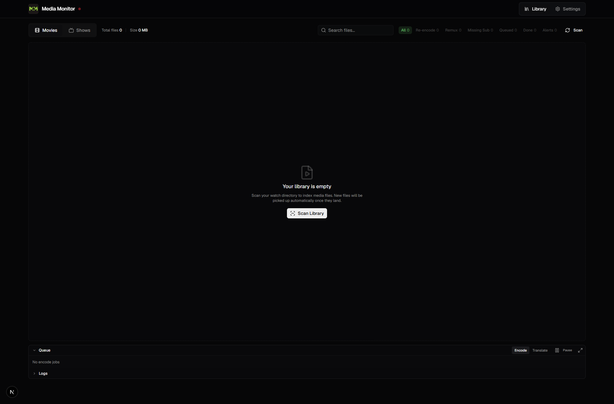
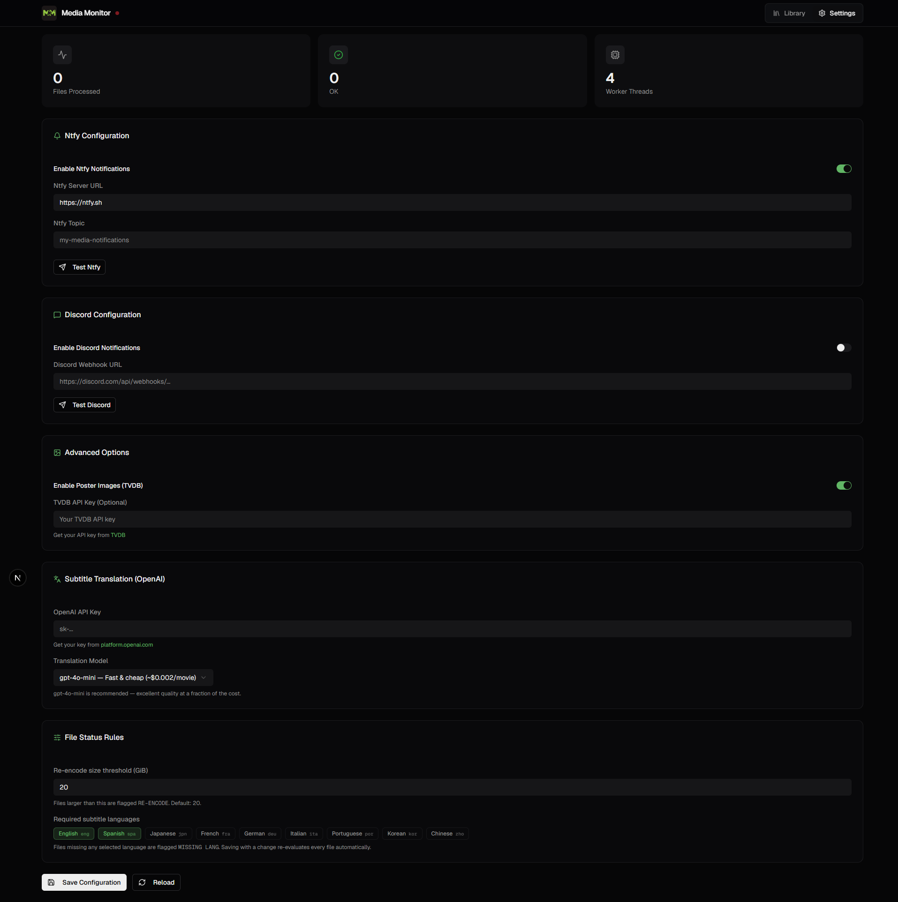

# 🎬 Media Monitor

A self-hosted media library manager with automatic file watching, rich notifications, GPU-accelerated encoding, and AI-powered subtitle translation — all wrapped in a modern web UI.

Built for Plex, Jellyfin, and any folder-based media server.

---

## 📸 Screenshots

<!-- Screenshot: Library view showing the compact toolbar, filters, scan action, queue, and logs -->


<!-- Screenshot: Settings view showing notifications, poster lookup, OpenAI, and file-status rules -->


---

## ✨ Features

### 📡 File Watching & Notifications
- Monitors a directory (recursively) for new `.mkv`, `.mp4`, `.avi`, `.mov`, `.m4v`, `.m2ts`, `.mts`, `.mpg`, `.mpeg`, `.vob`, `.webm`, `.wmv`, `.flv`, and `.3gp` files
- Waits for file stability before processing (configurable checks to detect when a copy finishes)
- Sends rich notifications via **Ntfy** and/or **Discord** (with poster art, codec details, and status)
- Classifies every file as `OK`, `REMUX` (missing language tags), or `RE-ENCODE` (above size threshold)
- SQLite-backed deduplication — no duplicate notifications on restart

### 🖥️ Media Library Browser
- Opens by default when you load the app
- Browse your entire library in a sortable, filterable table
- **Movies** view — one row per movie folder
- **Shows** view — grouped by show → season → episode tree
- Compact library totals show total files and size beside the Movies/Shows switch
- Filter by status: All · Needs Encoding · Needs Remux · Missing Language · Queued · Done · Alerts
- Per-file details: resolution, video codec, audio tracks with language tags, subtitle tracks, file size
- Inline estimated post-encode size for files that haven't been encoded yet
- **Re-scan folder** button per movie/show to refresh metadata on demand
- Empty library shows a prominent **Scan Library** button to get started quickly

### ⚡ GPU-Accelerated Encoding
- One-click queue to re-encode any file to HEVC (H.265) using NVIDIA NVENC
- In-place encoding: the original file is replaced on success
- Live progress: percentage, encoding speed, and estimated time remaining
- Automatic detection of stuck jobs with timeout recovery
- Cancel any queued or in-progress job
- Shows file size savings after completion

> **Requires an NVIDIA GPU and the NVIDIA Container Toolkit.** CPU encoding is not currently supported but is planned for a future release.

See [docs/encoding.md](docs/encoding.md) for full details.

### 💬 Subtitle Translation
- Translate any subtitle track to **Cuban Spanish** using the OpenAI API
- **Text subtitles** (SRT, ASS, SSA): extracted directly and sent to the model
- **Image subtitles** (PGS / Blu-ray): OCR'd first with Tesseract (using the track's language tag to pick the right language pack), then translated
- Output is saved as a `.es.srt` file alongside the video **and** muxed into the MKV as a new track
- Job queue with live progress and per-step status (`extracting` → `ocr` → `translating` → `muxing`)
- Requires an OpenAI API key (uses `gpt-4o-mini` by default, configurable)

> The target translation language is currently hardcoded to **Cuban Spanish**. Support for configuring the target language from the UI is planned for a future release.

See [docs/subtitle-translation.md](docs/subtitle-translation.md) for full details.

### 📎 External Subtitle Muxing
- Movies with no subtitle tracks get a **Mux Subtitle File** action in their ··· menu
- Scans the movie's directory for `.srt`, `.ass`, `.ssa`, `.vtt`, or `.sub` files
- Select the file and language from a dialog — job is queued immediately and runs through the same encode worker
- In-place operation: video and audio are never re-encoded, only the container is rewritten
- New subtitle track is reflected in the library as soon as the job completes

See [docs/media-library.md](docs/media-library.md) for full details.

### 🔤 Language Filtering (Encoding)
During encoding, only tracks in the approved language sets are kept in the output file:

| Track type | Kept languages |
|---|---|
| Audio | English · Spanish · Japanese |
| Subtitles | English · Spanish |

For audio, only the **highest-quality** track per language is kept (e.g. TrueHD is kept over AC-3 for the same language). All other tracks are dropped from the encoded output.

> These language lists are currently hardcoded. Per-user configuration from the UI is planned for a future release.

### 📊 Real-Time Logs
- In-app log viewer streamed from the backend
- Level filtering (info / warn / error)
- Collapsible panel in the Library view

---

## 🖥️ Requirements

| Requirement | Notes |
|---|---|
| Docker + Docker Compose | Any recent version |
| NVIDIA GPU | Required for encoding (NVENC). GTX 10xx or newer recommended |
| NVIDIA Container Toolkit | Required for GPU access inside Docker — [install guide](https://docs.nvidia.com/datacenter/cloud-native/container-toolkit/install-guide.html) |
| OpenAI API key | Required only for subtitle translation |
| Ntfy / Discord webhook | Required only for notifications |

> If you do not intend to use encoding, an NVIDIA GPU is not required — the rest of the application (file watching, notifications, library browser, subtitle translation) works on any machine.

---

## 🚀 Quick Start

### Option A — Docker Hub (recommended)

No build step required. Pull the pre-built images and start.

**1. Create a `docker-compose.yml`** (or download the one from this repo):

```yaml
services:
  backend:
    image: ivanchelo/media-monitor:latest
    container_name: media-monitor-backend
    restart: unless-stopped
    volumes:
      - /path/to/your/media:/watch        # read/write — needed for in-place encoding
      - ./config:/config                   # persistent config and database
    environment:
      - WATCH_DIR=/watch
      - PORT=5000
      - MAX_WORKERS=4
      - STABILIZE_INTERVAL=10
      - STABILIZE_CHECKS=3
      - REENCODE_SIZE_GB=20               # files larger than this are flagged RE-ENCODE

      # Set these here or through the web UI after first launch:
      # - NTFY_SERVER=https://ntfy.sh
      # - NTFY_TOPIC=my-media-notifications
      # - DISCORD_WEBHOOK=https://discord.com/api/webhooks/...
      # - OPENAI_API_KEY=sk-...
      # - OPENAI_MODEL=gpt-4o-mini
      # - TVDB_API_KEY=your-tvdb-key

    deploy:
      resources:
        reservations:
          devices:
            - count: all
              capabilities: [gpu, video]   # remove if no NVIDIA GPU

  frontend:
    image: ivanchelo/media-monitor-frontend:latest
    container_name: media-monitor-frontend
    restart: unless-stopped
    ports:
      - "3000:3000"
    environment:
      - BACKEND_URL=http://backend:5000
    depends_on:
      - backend
```

**2. Start the stack:**

```bash
docker compose up -d
```

**3. Open the UI at [http://localhost:3000](http://localhost:3000)**

---

### Option B — Build from Source

```bash
# Clone the repository
git clone https://github.com/your-username/media-monitor.git
cd media-monitor

# Build and start both containers
docker compose -f docker-compose.yml -f docker-compose.build.yml up -d --build
```

Or build each image manually:

```bash
# Backend
docker build -t media-monitor-backend .

# Frontend
docker build -t media-monitor-frontend ./frontend
```

> **Note on build time:** The backend image installs `tesseract-ocr-all` (all language packs for OCR) which is approximately 1 GB. First builds will take several minutes depending on your connection.

---

## ⚙️ Configuration

### Web UI

All settings can be configured from the **Settings** view after first launch:

| Setting | Description |
|---|---|
| **Ntfy server + topic** | Push notifications to your phone via the ntfy app |
| **Discord webhook** | Rich embed notifications to a Discord channel |
| **OpenAI API key** | Required for subtitle translation |
| **OpenAI model** | Default: `gpt-4o-mini`. Use `gpt-4o` for higher accuracy |
| **TVDB API key** | Optional — fetch poster art for notification embeds |

Settings are persisted to `/config/config.json` inside the container and survive restarts.

### Environment Variables

All environment variables can also be set directly in `docker-compose.yml`:

| Variable | Default | Description |
|---|---|---|
| `WATCH_DIR` | `/watch` | Directory to monitor for new files |
| `PORT` | `5000` | Backend API port (internal) |
| `MAX_WORKERS` | `4` | Parallel file processing threads |
| `STABILIZE_INTERVAL` | `10` | Seconds between file size checks |
| `STABILIZE_CHECKS` | `3` | Consecutive stable checks before processing |
| `REENCODE_SIZE_GB` | `20` | Files above this size (GB) are flagged RE-ENCODE |
| `NTFY_SERVER` | — | e.g. `https://ntfy.sh` |
| `NTFY_TOPIC` | — | Your ntfy topic name |
| `DISCORD_WEBHOOK` | — | Full Discord webhook URL |
| `OPENAI_API_KEY` | — | OpenAI API key for subtitle translation |
| `OPENAI_MODEL` | `gpt-4o-mini` | OpenAI model to use |
| `TVDB_API_KEY` | — | TheTVDB API key for poster art |
| `DB_FILE` | `/config/processed.db` | SQLite database path |
| `CONFIG_FILE` | `/config/config.json` | Config file path |

---

## 🏗️ Architecture

```
┌─────────────────────────────────┐     ┌─────────────────────────────────┐
│  Frontend  (port 3000)          │     │  Backend  (port 5000)           │
│  Next.js 16 · React 19          │────▶│  Python 3.11 · Flask            │
│  TypeScript · Tailwind · shadcn  │     │                                 │
└─────────────────────────────────┘     │  ┌─ File watcher (watchdog)     │
                                        │  ├─ Media analyzer (ffprobe)     │
                                        │  ├─ Encode worker (ffmpeg/NVENC) │
                                        │  ├─ Translate worker (OpenAI)    │
                                        │  ├─ OCR engine (Tesseract)       │
                                        │  └─ SQLite database              │
                                        └─────────────────────────────────┘
                                                       │
                                              /watch volume
                                        (your media directory)
```

**Backend workers run in separate threads:**
- **File watcher** — detects new files, waits for stability, runs ffprobe
- **Encode worker** — sequential GPU encoding queue
- **Translation worker** — sequential OCR + translation queue

**Data flow for a new file:**
1. Watchdog detects the file
2. Stability check (waits for copy to finish)
3. ffprobe extracts full media metadata
4. Status determined: `OK` / `REMUX` / `RE-ENCODE`
5. Notification sent to Ntfy and/or Discord
6. Record written to SQLite

---

## 🔔 Setting Up Notifications

### Ntfy

1. Install the [ntfy app](https://ntfy.sh) on your phone
2. Choose a unique topic name (e.g. `my-library-abc123`)
3. Subscribe to the topic in the app
4. Enter the server URL and topic in **Settings**

### Discord

1. Open your Discord server settings → Integrations → Webhooks
2. Click **New Webhook**, choose a channel, copy the URL
3. Paste it in **Settings**

### TVDB (optional — poster art in notifications)

1. Create a free account at [thetvdb.com](https://thetvdb.com)
2. Go to [API Information](https://thetvdb.com/api-information) and get your API key
3. Enter it in **Settings**

---

## 📁 File Structure

```
.
├── app.py                    # Backend: Flask API, file watcher, workers
├── requirements.txt          # Python dependencies
├── Dockerfile                # Backend container
├── docker-compose.yml        # Production stack (Docker Hub images)
├── entrypoint.sh             # Container entrypoint
├── templates/
│   └── index.html            # Legacy web UI (superseded by Next.js frontend)
├── frontend/
│   ├── app/
│   │   └── page.tsx          # Main page (Library + Settings views)
│   ├── components/
│   │   └── media-monitor/    # All UI components
│   ├── Dockerfile            # Frontend container (multi-stage Next.js build)
│   └── package.json
├── config/                   # Created automatically on first run
│   ├── config.json           # Saved settings
│   └── processed.db          # SQLite database
└── docs/
    ├── current_state.md      # Project state and known gaps
    ├── encoding.md           # Encoding feature walkthrough
    ├── subtitle-translation.md  # Subtitle translation + OCR walkthrough
    └── media-library.md      # Library browser guide
```

---

## 🗺️ Roadmap

- [ ] Configurable target translation language (currently hardcoded to Cuban Spanish)
- [ ] Configurable approved audio/subtitle language lists in the UI
- [ ] CPU encoding fallback (software HEVC via libx265)
- [ ] VOBSUB (DVD subtitle) OCR support
- [ ] Batch encode/translate from the UI
- [ ] User authentication for the web UI
- [ ] Production WSGI server (replace Flask dev server)
- [ ] Retry logic for failed notifications
- [ ] File logging (complement in-memory log buffer)

---

## 🐛 Troubleshooting

**Files not detected:**
- Verify the volume mount in `docker-compose.yml` (`/path/to/your/media:/watch`)
- Check that the file extension is supported (`.mkv`, `.mp4`, `.avi`, `.mov`, `.m4v`, `.m2ts`, `.mts`, `.mpg`, `.mpeg`, `.vob`, `.webm`, `.wmv`, `.flv`, `.3gp`)
- Check container logs: `docker logs media-monitor-backend`

**Encoding fails immediately:**
- Confirm your NVIDIA driver is installed on the host: `nvidia-smi`
- Confirm the NVIDIA Container Toolkit is installed and configured
- Check that the `deploy.resources` block is present in `docker-compose.yml`
- Encoding logs appear in the in-app log viewer (Library → Logs)

**Translation not starting:**
- Verify your OpenAI API key is saved in **Settings**
- Check your OpenAI account has available credits
- For PGS OCR jobs: the `ocr` phase runs before translation — progress will show "OCR frame N/N" first

**Backend unreachable (frontend shows connection error):**
- Confirm both containers are running: `docker compose ps`
- Confirm `BACKEND_URL=http://backend:5000` is set in the frontend service

**Container logs:**
```bash
docker logs media-monitor-backend  -f
docker logs media-monitor-frontend -f
```

---

## 🤝 Contributing

Issues and pull requests are welcome. For significant changes please open an issue first to discuss what you'd like to change.

---

## 📝 License

MIT License — Copyright (c) 2025 Ivan Ramirez Comas. See [LICENSE](LICENSE) for details.

---

*Made with ❤️ for media enthusiasts*
